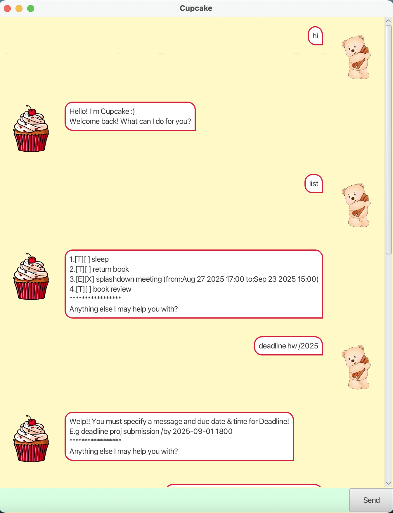

# Cupcake User Guide 🧁

Screenshot of Cupcake:

Cupcake is YOUR everyday task manager !! Big-or-Small tasks, 
your friendly chatbot Cupcake has got your back 🥳.

## Feature 1: Adding todo 

A todo task is an activity without any specified 
deadline or duration.

To add a todo task to your list of tasks, command 
format is `todo description`.

For example: 
>todo read book

The sample output by Cupcake will be:
>Okay I have added: [T][] read
> You now have 1 task! Let's go!!!
> *******************************
> Anything else I may help you with?

## Feature 2: Adding deadline ⏰

A deadline task is an activity with a specified
end date and time.

To add a deadline task to your list of tasks, command
format is `deadline description /by yyyy-mm-dd HHmm`.

For example:
>deadline project submission /by 2025-19-10 1500

The sample output by Cupcake will be:
>Okay I have added: [D][] project submission (by:Oct 19 2025 15:00)
> You now have 2 tasks! Let's go!!!
> *******************************
> Anything else I may help you with?

## Feature 3: Adding event 🗓️

An event task is an activity happening over 
a specified duration.

To add an event task to your list of tasks, command
format is `event description /from yyyy-mm-dd HHmm /to yyyy-mm-dd HHmm`.

For example:
>event seminar /from 2025-10-01 1400 /to 2025-10-15 1300

The sample output by Cupcake will be:
>Okay I have added: [E][] seminar (from:Oct 1 2025 14:00 to:Oct 15 2025 13:00)
> You now have 3 tasks! Let's go!!!
> *******************************
> Anything else I may help you with?

## Feature 4: Mark tasks ❎
Mark tasks that have been completed.

Command format is `mark taskNumber`.

For example:
>mark 2

Sample output by Cupcake will be:
>Wow look at you go champion!! I will mark it.
> [D][X] project submission (by:Oct 19 2025 15:00)
> ****************
> Anything else I may help you with?

## Feature 5: Unmark tasks
Unmark tasks that have been accidentally marked as 
completed.

Command format is `unmark taskNumber`.

For example:
>unmark 3

Sample output by Cupcake will be:
>Okay noted!! I will unmark it.
> [E][ ] seminar (from:Oct 1 2025 14:00 to:Oct 15 2025 13:00)
> ****************
> Anything else I may help you with?

## Feature 6: Delete tasks ⛔️
Remove tasks from the task list.

Command format is `delete taskNumber`.

For example:
>delete 2

Sample output by Cupcake will be:
>Okay noted!! I will DELETE this from the list.
> [D][X] seminar (from:Oct 1 2025 14:00 to:Oct 15 2025 13:00)
> You now only have 2 number of tasks.
> ****************
> Anything else I may help you with?

## Feature 7: List all the tasks 📋
Lists out all the tasks you have added.

For example:
>list

Sample output by Cupcake will be:
>1.[T][ ] read   
>2.[E][ ] seminar (from:Oct 1 2025 14:00 to:Oct 15 2025 13:00)  
> ****************
> Anything else I may help you with?

## Feature 8: Find tasks 🕵️‍♀️
Find tasks using part of the description.

Command format is `find substring`.

For example:
>find ea

Sample output by Cupcake will be:
>1.[T][ ] read
> ****************
> Anything else I may help you with?

## Feature 9: To exit and save 👋
Use bye command to end the session and prompt
Cupcake to write the updated tasks into the 
hard-drive's Cupcake.txt file. 

For example:
>bye

Sample output by Cupcake will be:
>The content that will be written:  
> 1.[T][ ] read
> 2.[E][ ] seminar (from:Oct 1 2025 14:00 to:Oct 15 2025 13:00)
> 
> Bye. Hope to see you again real soon!

